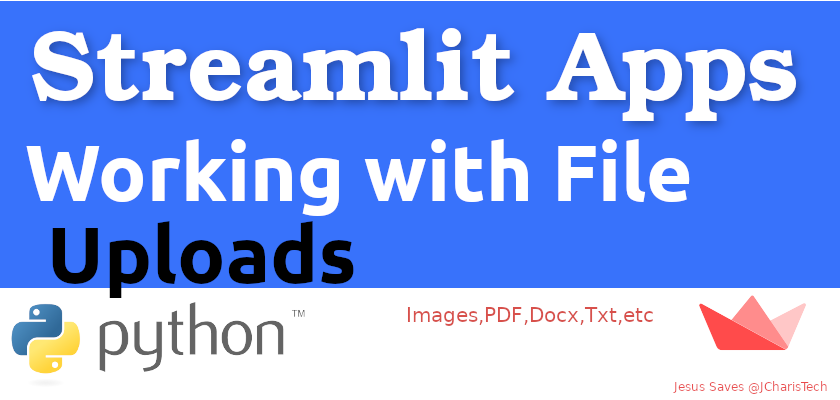

# Assignment 2 : MGMT 590, Production Scale Data Products, Summer 2021

## Creating Flask Application - Question Answering

Purpose of the this hands-on project was to create a REST API inference server that serves inferences from a Transformers NLP model
The app is deployed at: https://mgmt590-assignment-2-kbmrvvvzgq-uc.a.run.app




## Learning Outcomes

At the end of the this hands-on training, students will be able to;

- Understand client-server software architecture.

- Get familiar with Python Flask framework.

- Automated deploy using a GitHub Action that executes the following on merges into the
master branch of your GitHub repository

- Build an API accessible on the public Internet

- Use git repo to manage the application versioning.

- Using a SQLite database to log all answered questions

## Outline

- Part 1 - About Streamlit 

- Part 2 - Getting to know the Python Flask framework

- Part 3 - Dependencies

- Part 4 - REST API endpoints

- Part 5 - Building and running the API locally

- Part 6 - CI/CD with Github Actions and Google Cloud Run


## Part 1 - About Streamlit

Streamlit is an open-source Python library that makes it easy to build beautiful custom web-apps for machine learning and data science.

To use it, just pip install streamlit, then import it, write a couple lines of code, and run your script with streamlit run [filename]. Streamlit watches for changes on each save and updates the app live while you’re coding. Code runs from top to bottom, always from a clean state, and with no need for callbacks. It’s a simple and powerful app model that lets you build rich UIs incredibly quickly. To learn more about how Streamlit works, see Main concepts.

You may also want to check out this four-part video recorded at our PyData talk on December 2019. In it we describe the motivation behind Streamlit, then go over how to install and create apps with it.

## Installation Steps

1. Make sure that you have Python 3.6 or greater installed.
2. Install Streamlit using PIP:
   * pip install streamlit


## ## Usage
### Without Docker
To run the dashboard, please execute the following from the root directory:

```bash
pip3 install -r requirements.txt
streamlit run dashboard.py
```

When run locally, the dashboard is accessible here:
```
http://localhost:8501
```


### With Docker
To run the web app using Docker containers, please execute the following from the root directory:

```bash
docker build -t dashboard .
docker run -d --name dashboard -p 8501:8501 dashboard
```


## Part -3 Dependencies

The Dependencies are in the `requirements.txt` namely:

Flask==1.1.2

transformers==4.2.2

if you want to exactly rebuild the development environment
run the following command:

    (venv) $ pip install -r requirements.txt
    
The required packages are outdated very quickly and you can try to use newer versions.
If you experience problems you can always go back and use the version specified here.

To generate your own requirements file use

    (venv) $ pip freeze >requirements.txt 

## Part-4 The available endpoints are:


##List Available Models
- GET  `/models`: This route allows a user to obtain a list of the models currently loaded into the server and available for inference :

Expected Response Format :

  ```json
[
    {
        "name": "distilled-bert",
        "tokenizer": "distilbert-base-uncased-distilled-squad",
        "model": "distilbert-base-uncased-distilled-squad"
    },
    {
        "name": "deepset-roberta",
        "tokenizer": "deepset/roberta-base-squad2",
        "model": "deepset/roberta-base-squad2"
    }
]
  ```

## Add a Model
- PUT  `/models`: This route allows a user to add a new model into the server and make it available for inference.

Expected Request Format :

  ```json
    {
        "name": "distilled-bert",
        "tokenizer": "distilbert-base-uncased-distilled-squad",
        "model": "distilbert-base-uncased-distilled-squad"
    }
  ```

Expected Response Format :

  ```json
[
    {
        "name": "distilled-bert",
        "tokenizer": "distilbert-base-uncased-distilled-squad",
        "model": "distilbert-base-uncased-distilled-squad"
    },
    {
        "name": "deepset-roberta",
        "tokenizer": "deepset/roberta-base-squad2",
        "model": "deepset/roberta-base-squad2"
    }
]
  ```
## Delete a Model

- DELETE   `/models?model=<model name>`: This route allows a user to delete an existing model on the server such that it is no longer available for inference.

Query Parameters:
`<model name> (required) - The name of the model to be deleted`

Expected Response Format(updated list of available models) :

  ```json
[
    {
        "name": "distilled-bert",
        "tokenizer": "distilbert-base-uncased-distilled-squad",
        "model": "distilbert-base-uncased-distilled-squad"
    },
    {
        "name": "deepset-roberta",
        "tokenizer": "deepset/roberta-base-squad2",
        "model": "deepset/roberta-base-squad2"
    }
]
  ```

## Answer a Question

- POST  `/answer?model=<model name>`: This route uses one of the available models to answer a question, given the context provided in the JSON payload.

Query Parameters:
`<model name> (optional) - The name of the model to be used in answering the
question. If no model name is provided use a default model.`

Expected Request Format :

  ```json
{
  "question": "who did holly matthews play in waterloo rd?",
  "context": "She attended the British drama school East 15 in 2005,and left after winning a high-profile role in the BBC drama Waterloo Road, playing the bully Leigh-Ann Galloway.[6] Since that role, Matthews has continued to act in BBC's Doctors, playing Connie Whitfield; in ITV's The Bill playing drug addict Josie Clarke; and she was back in the BBC soap Doctors in 2009, playing Tansy Flack."
}
  ```

Expected Response Format :

  ```json
{
  "timestamp": 1621602784,
  "model": "deepset-roberta",
  "answer": "Leigh-Ann Galloway",
  "question": "who did holly matthews play in waterloo rd?",
  "context": "She attended the British drama school East 15 in 2005,and left after winning a high-profile role in the BBC drama Waterloo Road, playing the bully Leigh-Ann Galloway.[6] Since that role, Matthews has continued to act in BBC's Doctors, playing Connie Whitfield; in ITV's The Bill playing drug addict Josie Clarke; and she was back in the BBC soap Doctors in 2009, playing Tansy Flack."
}
  ```
##List Recently Answered Questions

- GET  `/answer?model=<model name>&start=<start timestamp>&end=<end
timestamp>`: This route returns recently answered questions
  
Query Parameters:

`<model name> (optional) - Filter the results by providing a certain model name, such
that the results only include answered questions that were answered using the provided
model.`

`<start timestamp> (required) - The starting timestamp, such that answers to questions
prior to this timestamp won't be returned. This should be a Unix timestamp.`

`<end timestamp> (required) - The ending timestamp, such that answers to questions
after this timestamp won't be returned. This should be a Unix timestamp.`

Expected Response Format :

  ```json
[
    {
        "timestamp": 1622100672,
        "model": "distilled-bert",
        "answer": "Leigh-Ann Galloway",
        "question": "who did holly matthews play in waterloo rd?",
        "context": "She attended the British drama school East 15 in 2005,and left after winning a high-profile role in the BBC drama Waterloo Road, playing the bully Leigh-Ann Galloway.[6] Since that role, Matthews has continued to act in BBC's Doctors, playing Connie Whitfield; in ITV's The Bill playing drug addict Josie Clarke; and she was back in the BBC soap Doctors in 2009, playing Tansy Flack."
    },
    {
        "timestamp": 1622100683,
        "model": "distilled-bert",
        "answer": "Leigh-Ann Galloway",
        "question": "who did holly matthews play in waterloo rd?",
        "context": "She attended the British drama school East 15 in 2005,and left after winning a high-profile role in the BBC drama Waterloo Road, playing the bully Leigh-Ann Galloway.[6] Since that role, Matthews has continued to act in BBC's Doctors, playing Connie Whitfield; in ITV's The Bill playing drug addict Josie Clarke; and she was back in the BBC soap Doctors in 2009, playing Tansy Flack."
    }
]
 ```
## Part 5 : Building and running the API locally

### Running Locally with Python and Flask

To run this application on your local operating system, you will need to have
[Python installed](https://www.python.org/downloads/).

1. Install required dependencies using the Python package installer (`pip`):

   ```
   $ pip install -r requirements.txt
   ```

1. Run the app:

   ```
   $ FLASK_APP=answers.py flask run
   ```

1. Navigate to `http://localhost:8080` in your web browser to access the running
   application

### Running Locally with Docker

This application may be run locally using
[Docker](https://docs.docker.com/get-docker/).

1. Build the Docker image:

   ```
   $ docker build -t mgmt590-assignment-2
   ```

1. Run the docker container:
   ```
   $ docker run --env PORT=8080 -p 8080:8080 mgmt590-assignment-2
   ```

1. Navigate to `http://localhost:8080` in your web browser to access the running
   application

### Deploying with Google Cloud Run

This application can be deployed to Google Cloud Run. This requires a Google
account.

1. Select or create a Google Cloud project using the
[Google Cloud Console](https://console.cloud.google.com/projectselector2/home/dashboard)

1. Install and initialize the [Google Cloud SDK](https://cloud.google.com/sdk/docs/install)

1. Build and deploy the application to Google Cloud Run, following the on-screen
   prompts:

   ```
   $ export PROJECT_ID=$(gcloud config get-value project)
   $ gcloud builds submit --tag gcr.io/$PROJECT_ID/py-calc
   $ gcloud run deploy --image gcr.io/$PROJECT_ID/py-calc --platform managed
   ```

1. When complete, the last command execute in the previous step will display the
   URL of deployed application; navigate to that URL in your web browser to
   access the application.
   
## Part 6 - CI/CD with Github Actions and Google Cloud Runs

To automate the process of building and deploying images to Google Cloud Run, we can utilize Google Cloud Run GitHub Action. 

Related documentation is available [here](https://github.com/GoogleCloudPlatform/github-actions/blob/master/example-workflows/cloud-run/README.md).

# Pre-requisites

1. [Create a Google Cloud Service Account](https://cloud.google.com/iam/docs/creating-managing-service-accounts)

2. Add the following Cloud IAM roles

`Cloud Run Admin`

`Cloud Build Editor`

`Cloud Build Service Account`

`Viewer`

`Service Account User`

3. [Create a Service Account JSON key](https://cloud.google.com/iam/docs/creating-managing-service-account-keys)

4. Add a GitHub Secret to your repository:

`RUN_SA_KEY` : Content of service account JSON Key that was generated in previous step.

5. Set workflow variables

`PROJECT_ID` : Google Cloud Project ID

`SERVICE_NAME` : Service Name. This name will be used as the image name and service name.

# Example GitHub Action Workflow

```
    # Setup GCloud CLI
    - uses: GoogleCloudPlatform/github-actions/setup-gcloud@master
      with:
        version: '286.0.0'
        service_account_key: ${{ secrets.RUN_SA_KEY }}
        project_id: $PROJECT_ID

    # Build and push image to Google Container Registry
    - name: Build
      run: |-
        gcloud builds submit \
          --quiet \
          --tag "gcr.io/$PROJECT_ID/$SERVICE_NAME:$GITHUB_SHA"

    # Deploy image to Cloud Run
    - name: Deploy
      run: |-
        gcloud run deploy "$SERVICE_NAME" \
          --quiet \
          --region "$RUN_REGION" \ # E.g. centralus1
          --image "gcr.io/$PROJECT_ID/$SERVICE_NAME:$GITHUB_SHA" \
          --platform "managed" \
          --allow-unauthenticated
```
